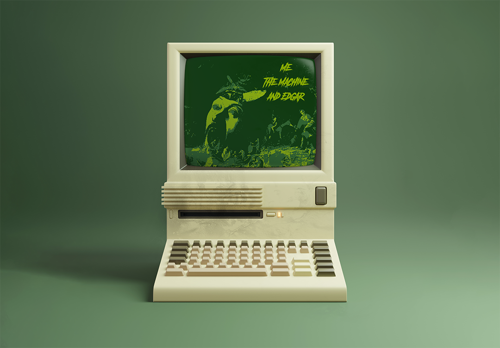

# Me The Machine and Edgar

### A collaboration between the designer, an AI, and Edgar Allen Poe.

The game intends to explore the concept of authorship and the bounds of ownership of works created with an AI.

An AI was trained using the collected works of Edgar Allen Poe to generate raw text for the game scripts, which are then curated by the designer to form the entire game dialogue.

